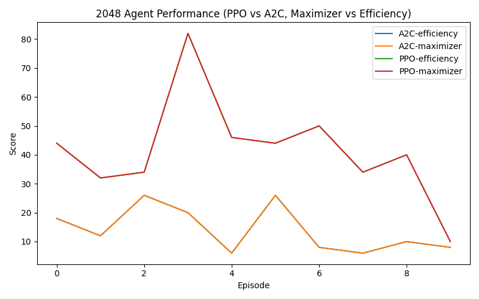

# DRL for Automated Testing — 2048 + ____

# 1. 2048 Deep Reinforcement Learning Game 

##  Overview
This part of the project applies **Deep Reinforcement Learning (DRL)** to automate gameplay and testing for the **2048 puzzle game**.  
The goal was to train and evaluate agents that can discover optimal merging strategies and test the game’s performance and logic through autonomous play.

Two DRL algorithms were implemented using **Stable-Baselines3**:
- **PPO (Proximal Policy Optimization)**
- **A2C (Advantage Actor-Critic)**

Each agent was tested under two **reward personas**:
- **Maximizer** – focuses on achieving the highest tile and score possible.  
- **Efficiency** – focuses on longer survival and fewer unnecessary moves.

This setup demonstrates how **reward design** changes AI behavior and outcomes, aligning with the assignment’s “Personas via Rewards” and “Metrics & Evaluation” goals.


## Quick Start
```bash
python -m venv .venv
source .venv/bin/activate  # (Windows: .venv\Scripts\activate)

pip install -r requirements.txt

```
---

## Architecture
| Folder | Description |
|---------|-------------|
| `envs/game_2048_env.py` | Custom OpenAI Gym-style environment for 2048 with reward-persona logic. |
| `src/train.py` | Training scripts for PPO and A2C agents. |
| `src/eval.py` | Evaluation script that logs episode metrics to CSV. |
| `src/plot_results.py` | Generates comparison plots between algorithms and personas. |
| `models/` | Saved PPO and A2C model weights. |
| `logs/` | Stores per-episode metrics (`2048_metrics.csv`). |
| `plots/` | Contains final learning comparison plot. |

---


## Results

The following figure compares the performance of **PPO** and **A2C** agents under the **Maximizer** and **Efficiency** personas.



**Findings:**
- **PPO-Maximizer** achieved the highest scores overall, showing strong merging strategies.  
- **A2C** maintained steadier performance but achieved lower tile peaks.  
- **Efficiency** personas prioritized survival, leading to lower scores but longer games.  

This demonstrates how **reward functions shape agent behavior**, a key component of DRL testing.

---

## 🧾 Metrics and Data Collection
During evaluation, each episode’s performance metrics are automatically logged to `logs/2048_metrics.csv`, including:
- Total score  
- Max tile reached  
- Episode length (steps)  
- Algorithm and persona used  

Example:
```
timestamp,episode,score,max_tile,steps,persona,algorithm
2025-10-26 14:23:12,1,952,128,101,maximizer,PPO
2025-10-26 14:24:03,2,812,64,89,efficiency,PPO
```

## Reproducibility
```bash
# PPO Training (if retraining)
python src/train.py --algo ppo --seed 7

# A2C Training (if retraining)
python src/train.py --algo a2c --seed 7

# Evaluate both algorithms under both personas
python src/eval.py --model models/ppo_2048_seed7.zip --episodes 10 --persona maximizer
python src/eval.py --model models/ppo_2048_seed7.zip --episodes 10 --persona efficiency
python src/eval.py --model models/a2c_2048_seed7.zip --episodes 10 --persona maximizer
python src/eval.py --model models/a2c_2048_seed7.zip --episodes 10 --persona efficiency

# Generate comparison plot
python src/plot_results.py

```

All runs produce metric logs and an updated figure saved to `plots/2048_agent_comparison.png`.


